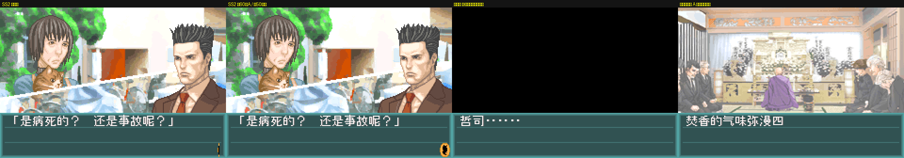
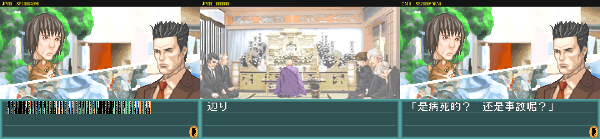

# 卡死分析：SS2 里对话不推进

> 状态：**已定位到「卡在快照的引擎中间态」，但「原版固有缺陷」还是「快照损坏」尚未判定**。
> 换电脑后按第六节继续。

---

## 一、症状

用户提供的即时存档 `侦探神宫寺三郎 - 白影的少女 (简中).ss2`（**不在版本控制里**，见第七节）：

* 载入后画面停在 **e500 第 204 行**「是病死的？ 还是事故呢？」，文本框右下角的
  「继续」指示球变成一个细竖条；
* 按 A / B / START / SELECT / 方向键**都没反应**，脚本不推进；
* 游戏本身还活着：帧循环、中断、指示器动画都在跑（PC 采样可见每帧正常工作）。

用 `make where STATE="…ss2"` 看引擎状态：

```
池基址      0x02030AA0
资源缓冲    0x02030300
行数        31
行表位置    池内 +0x125B
游标        0x158D   → 刚读完第 204 项
当前行偏移  0x28A3
当前行文本  」是病死的！、还是事故呢！『
```

## 二、实测对照（都按 A，看游标 `0x03007C40`）

| 组合 | 结果 |
|---|---|
| 中文版 + **SS2** | 游标不动（跑 3100 帧、按 60 次 A、按住 A 都不动） |
| **日文原版 + SS2** | **也不动**（画面同幕，文本乱码——CN 存档的码位用日文字库画） |
| 日文原版 + 真·新游戏（`START@5000 A@5300` 跑到第一段对白） | `0x014C → 0x0150 → 0x0154 → 0x0158` ✓ |
| 中文版 + 真·新游戏（同上） | 第 2 项 → 第 5 项（「重逢…”」→「压得胸口发紧，」）✓ |





另外试过**不用即时存档**、在新鲜状态上换 4 种按键时序（长按 120 帧 / 每 2 帧点一次 /
慢速 / 中速）：**4 种都正常推进，打不死** → 不是常见的「打字机被按键时序卡住」。

## 三、原始引擎逻辑（已定位到地址）

**输入链**（每帧一次）：`0x0800043C` 读 `0x04000130` → 写输入块 **`0x02000DD0`**：

| 偏移 | 含义 |
|---|---|
| +4 | 当前按下（`0x03FF ^ keypad`） |
| +6 | 取反 |
| **+8** | **新按下（边沿）** |
| +0xA | 新松开 |
| +0xE | 长按重复计数 |

菜单与对白实际读 **`0x02003EEC`** 的边沿位（bit0/1 = A/B）。

**推进链**：`0x08019C60`（每帧）读 `0x02003EEC` 的 bit0|1：

```
若 (A|B) 未按下 → 调 0x80194CC 问「文字还在打字吗」；还在打字 → return（等下一帧）
若 按了 A/B 或 打字已完成 → 走推进路径
     0x800B944 → 0x8019F5C → 0x8019730 → 0x801967C（翻页 / 重画 / 取下一行）
```

**脚本游标**（`docs/调试器.md` 有完整说明）：

| 位置 | 含义 |
|---|---|
| IWRAM `0x03007C40` | 刚读完的行表项偏移 + 2（推进时 +4） |
| IWRAM `0x03007C44` | 当前行偏移（池内相对） |
| EWRAM `0x02003F24` | 描述符：池基址 / ROM 指针 / 资源缓冲 / … / 行数 |

**SS2 实测**：按键寄存器 `0x04000130` 按下时 `03FF → 03FE` ✓；`0x02003EEC` 在按下那一帧
置 1、下一帧清 0 ✓；按 A 后推进路径确实跑了（同帧 RAM 差分只有 4 个字节变化，其中一处
正是输入块的长按计数 `0x02000DDE`）——但**游标与当前行一步不变**。

## 四、已排除的可能

| 猜疑 | 检查 | 结果 |
|---|---|---|
| 这一行的**数据**被写坏了 | SS2 的剧本池与当前 ROM 的 e500 逐字节比对 | 一致 → 至少"ROM 里这段数据"与快照一致 |
| 条目没 4 字节对齐 → BIOS LZ77 解压失败（文档里踩过的坑） | 扫全部 1024 个条目 | 全部对齐 ✗ 排除 |
| 精灵花屏（`check_state.py` 那类） | `tools/check_state.py ss1 ss2` | 都 OK ✗ 排除 |
| 按键时序把打字机卡住 | 4 种时序在新鲜状态上打 | 都推得动 ✗ 排除 |
| 按键没送到游戏 | 按键寄存器 / `0x02003EEC` 边沿 | 都正常 ✗ 排除 |
| 两版引擎**代码**差异 | 本工程从不改代码，只改数据 | ✗ 排除 |

## 五、待判定：两种可能

1. **原版引擎的快照态死锁**：引擎把逐帧推进依赖的计时/动画/边沿中间量冻在某一瞬间，
   恢复后没有任何代码路径再把它推走；
2. **快照本身不一致**（VRAM/RAM 冻在过渡帧）。

**为什么现在还不能定论**：

* 引擎代码两个 ROM **完全相同**，所以"日文原版也卡"只排除代码差异；
* "新鲜状态能推进"用的是**真·新游戏**（不是任何注入），它只证明"引擎在新游戏起点正常"，
  **不能**证明"正常剧情走到第 204 行也能推进"——那需要真的走到那里。

> 📌 **教训（已删除的功能）**：本工程曾经有过 `romdbg.py jump`，做法是"文本级注入"——
> 把目标行写进当前已载入的行表、改游标，就宣称"跳到了那一行"。那是**假的**：背景、
> 在场人物、分支标志全是当前那一幕的。用它做对照会把真问题盖住（卡死、花屏、剧情不对
> 都可能被它骗过去），所以整套功能已从工具和文档里删除。要看某句话，只能在游戏里
> 正常走到，或拿游戏内存档 + `play` 复跑。

## 六、继续排查（换电脑后照这个做）

### 0) 环境

```bash
make dbg        # 编译 work/bin/gbarun_dbg（需要 libmgba）
make env        # 检查依赖
```

本轮给 harness 新增/用到的环境变量（`legacy/gbarun_dbg.c`）：

| 环境变量 | 作用 |
|---|---|
| `GBARUN_SAVFILE=<x.sav>` | 把卡带存档（EEPROM 8 KB）喂给模拟器。`mCoreAutoloadSave()` 在本 harness 里永远失败（没设 `core->dirs.save`），不加这个游戏跑在**空白卡带**上 |
| `GBARUN_SAMPLE=<步数>` | 单步采样 PC：4 KB 直方图（top 20）+ 最近 64 个去重 PC。配合 `GBARUN_STATE` 可对着 `.ssN` 采集，用来回答"卡在哪" |
| `GBARUN_RAMSNAP="帧:前缀"` | dump EWRAM/IWRAM（`.ewram` / `.iwram`），做同帧差分 |
| `GBARUN_LOGSTORE="lo:hi"` | 追踪写入，输出 `/tmp/gbarun_mem.txt` |

### 1) 最重要：拿到「卡住之前」的即时存档

死档本身无法判定原因，需要卡前那一刻的状态；或者现场复现一次（正常游玩时卡住）。

### 2) 同帧「有/无 A」RAM 差分（找出推进路径读了哪个状态位）

```bash
ROM="侦探神宫寺三郎 - 白影的少女 (简中).gba"
GBARUN_STATE=x.ssN GBARUN_RAMSNAP="119:work/dbg/n1" work/bin/gbarun_dbg "$ROM" 120 n1.ppm
GBARUN_STATE=x.ssN GBARUN_RAMSNAP="119:work/dbg/n2" work/bin/gbarun_dbg "$ROM" 120 n2.ppm A@60:20
# 同一帧对比，差异就只剩"按键造成的"
cmp -l work/dbg/n1.ewram work/dbg/n2.ewram | head
cmp -l work/dbg/n1.iwram  work/dbg/n2.iwram  | head
```

（SS2 上这么做的结果：EWRAM 只有 3 处、IWRAM 只有 1 处差异，都是输入/计数类变量。）

### 3) 顺着推进链往下追

从 `0x08019C60` 起，看 `0x80194CC`（打字完成？）、`0x800B944`、`0x8019F5C`、
`0x8019730`、`0x801967C` 各自读的状态位；再看游标更新点
（`0x080094B0..0x08009840` 一带的"载入块 / 取行"代码）。抓"谁写了游标"：

```bash
GBARUN_STATE=x.ssN GBARUN_LOGSTORE="0x03007C40:0x03007C48" \
  work/bin/gbarun_dbg "$ROM" 400 out.ppm A@150:6 A@250:6
# 注意 0x03007C40 一带也是栈区，trace 里的 STM 行是栈帧噪声
```

### 4) 判定标准

* 若不走的状态位是**计时/动画帧数** → 原版引擎的**快照态死锁**（可给出确切代码地址与复现条件）；
* 若该位是被**数据**写坏的 → 汉化的问题（改数据/改生成工具）。

### 5) 验证"正常剧情走到这里会不会卡"

从游戏内存档往这段剧情走（`侦探神宫寺三郎 - 白影的少女 (简中)-出错.sav` 的 FILE 01
正好在 `3/12昼 游戏 0时49分 中野公寓楼`）。GUI：标题 →「继续游戏」→ SELECT 界面
→「读取」→「是的」。卡住就存一份**卡前**状态。

> 无头驱动这一步还没打通：SELECT 界面里 A 只是进出确认框（引擎状态 3 ⇄ 4），
> START / SELECT / 方向键都不推进。菜单状态机已定位：跳转表 file `0x151C0`（10 个状态），
> state 3 = 文件列表、state 4 = 确认框、state 5 = 动作派发，读档调用点在 `0x0801573E`
> （`bl 0x8015AD0`）。

## 七、相关文件与注意事项

| 文件 | 说明 |
|---|---|
| `docs/存档格式.md` | EEPROM 存档格式（头魔数 + 加法校验和、每槽 340 块）与「损坏」判定链 |
| `docs/调试器.md` | `romdbg.py` 用法：`where / list / find / play / base` |
| `docs/卡死分析/*.png` | 本文的对照截图（已入库） |
| `work/savtest/*.png`、`work/dbg/*.ss1` | 本轮过程截图 / 基准存档（**在 work/ 里，`make clean` 会删掉**） |

> ⚠️ **`.ssN` 与 `.sav` 都不在版本控制里**（`.gitignore`: `*.ss[0-9]` / `*.sav`）。
> 换电脑继续排查要把
> `侦探神宫寺三郎 - 白影的少女 (简中).ss1`、`…ss2`、`…-出错.sav`
> 手动带过去（已复制到 `~/Desktop/神宫寺三郎-roms/`）。
> 另外 `.ssN` 是**按 ROM 版本**的快照：换 ROM 载入会画错字（见 `docs/打包流程.md` 第 12 节），
> 但引擎行为仍可参考。
